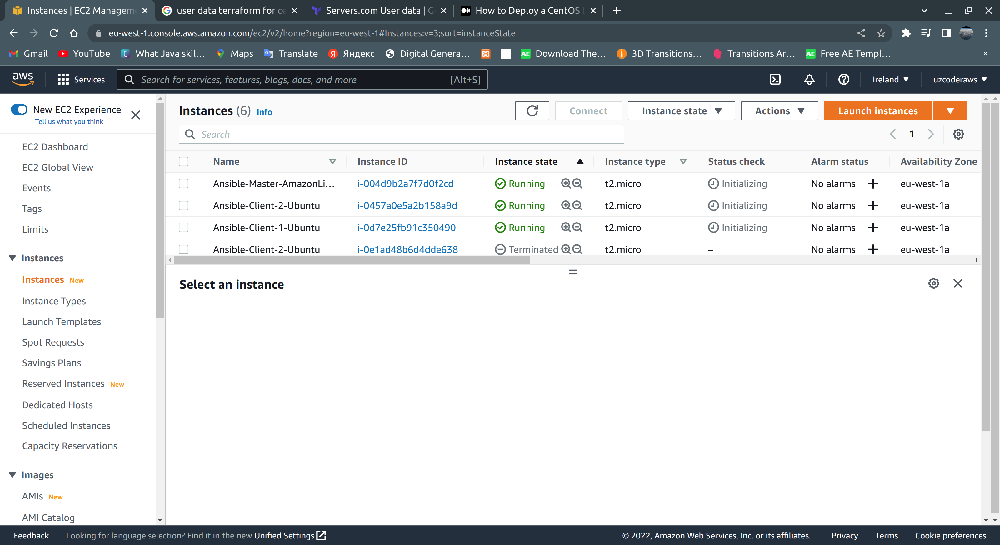
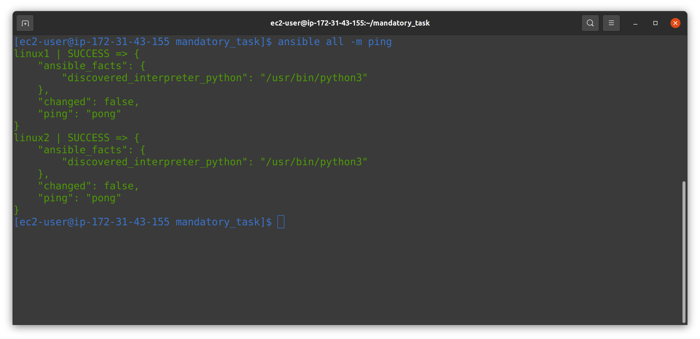

# Task 5 : Ansible

### Important points:

<h4>
1. Read documentation about System configuration management. 
2. Learn about the advantages and disadvantages of Ansible over other tools. 
3. Become familiar with ansible basics and YAML syntax. 
4. Basics of working with Ansible from the official documentation. 
5. EXTRA Read the Jinja2 templating documentation. 
<h4>

## Mandatory Tasks

## Task 1

###  I deployed three EC2 Instances in AWS: Amazon Linux, and two Ubuntu by using Terraform [main.tf](./mandatory_task/main.tf)

###  I installed Ansible on Amazon Linux by using shell script
<pre>
sudo yum install epel-release -y
sudo yum install ansible -y
</pre>

## Tasks 2

###  Firstly I created "hosts.txt" to connect from Master server to Client servers and "ansible.cfg" file to not allow host key checking.

#### [hosts.txt](./mandatory_task/hosts.txt)
<pre>
[linux_servers]
linux1 ansible_host=ubuntu@ec2-54-195-171-119.eu-west-1.compute.amazonaws.com
linux2 ansible_host=ubuntu@ec2-54-75-78-152.eu-west-1.compute.amazonaws.com

[linux_servers:vars]
ansible_user=ec2-user
ansible_ssh_private_key_file=/home/ec2-user/.ssh/ssh_key.pem
</pre>

#### [ansible.cfg](./mandatory_task/ansible.cfg)
<pre>
[defaults]
host_key_checking = false
inventory = ./hosts.txt
</pre>

### I executed the built-in ansible ping command.
<pre>
ansible all -m ping
</pre>

### 3. I wrote a playbook for installing Docker on two machines and run it by following command: <pre>
ansible-playbook playbook.yml       
</pre>

#### [playbook.yml](/mandatory_task/playbook.yml)
<pre>
---
- name: Install Docker
  hosts: all
  become: true
  tasks:
    - name: Install apt-transport-https
      ansible.builtin.apt:
        name:
          - apt-transport-https
          - ca-certificates
          - lsb-release
          - gnupg
          - curl
        state: latest
        update_cache: true

    - name: Add signing key
      ansible.builtin.apt_key:
        url: "https://download.docker.com/linux/{{ ansible_distribution | lower }}/gpg"
        state: present

    - name: Add repository into sources list
      ansible.builtin.apt_repository:
        repo: "deb [arch={{ ansible_architecture }}] https://download.docker.com/linux/{{ ansible_distribution | lower }} {{ ansible_distribution_release }} stable"
        state: present
        filename: docker

    - name: Install Docker
      ansible.builtin.apt:
        name:
          - docker
          - docker.io
          - docker-compose
          - docker-registry
        state: latest
        update_cache: true

</pre>

